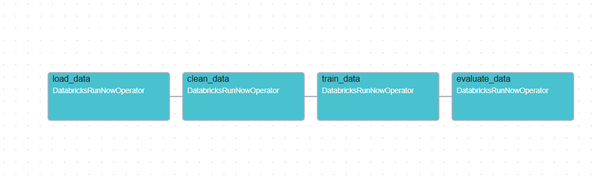
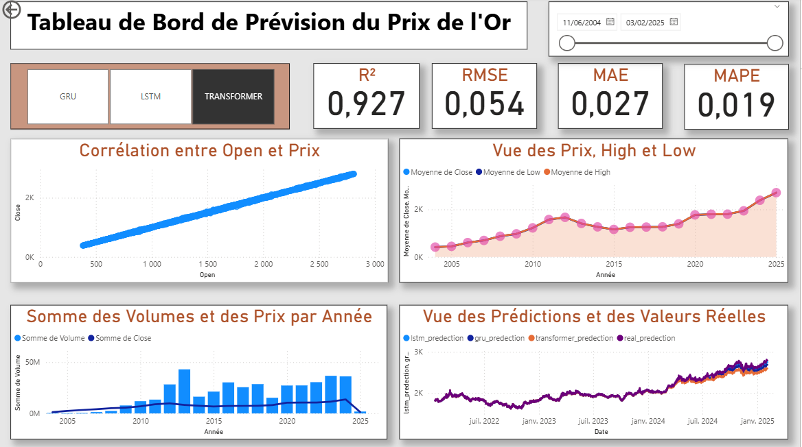

# Amélioration des prédictions du marché de l'or en utilisant l'architecture Lambda et le Deep Learning
# Gold Price Prediction using Lambda Architecture and Deep Learning

## Description / Description

**FR:**  
Ce projet vise à améliorer les prédictions du marché de l'or en utilisant l'architecture Lambda et des modèles de Deep Learning tels que LSTM, GRU et Transformer. Le projet intègre également des outils Big Data comme Spark, Databricks, AWS S3 et l'orchestration des tâches via Apache Airflow.

**EN:**  
This project aims to enhance gold market predictions using Lambda Architecture and Deep Learning models such as LSTM, GRU, and Transformer. It also leverages Big Data tools like Spark, Databricks, AWS S3, and task orchestration via Apache Airflow.

---

## Tools & Technologies / Outils & Technologies

- Python  
- Spark  
- Databricks  
- Apache Airflow  
- Deep Learning: LSTM, GRU, Transformer  
- Power BI  
- AWS S3  

---

## Data / Données

**FR:**  
Les données pour ce projet sont disponibles via GitHub ou API.  
Lien GitHub : [Dataset](https://github.com/ogh04/gold-api/blob/main/omar.csv)  


**EN:**  
The dataset for this project is available via GitHub or API.  
GitHub Link: [Dataset](https://github.com/ogh04/gold-api/blob/main/omar.csv) 


---

## Apache Airflow DAGs / DAGs Apache Airflow

**FR :**  
Tous les fichiers DAG sont situés dans le dossier `airflow_dags/`.  
Pour visualiser le workflow, les images sont disponibles dans `airflow_dags/orchestration.png`.  

Exemple d'image :  


**EN :**  
All DAG files are located in the `airflow_dags/` folder.  
To visualize the workflow, images are available in `airflow_dags/orchestration.png`.  

Example image:  


---

## Power BI Dashboards / Dashboards Power BI

**FR :**  
Tous les fichiers Power BI sont situés dans le dossier `power_bi/`.  
Les fichiers `.pbix` et les images exportées sont disponibles pour analyse.  

Exemple de dashboard :  


**EN :**  
All Power BI files are located in the `power_bi/` folder.  
`.pbix` files and exported images are available for analysis.  

Example dashboard:  


---

## How to Run / Comment exécuter

1. Clone the repository / Cloner le projet  
   ```bash
   git clone https://github.com/username/GoldPricePrediction_Lambda_DL.git
2.insatll dependencies / installer les dépendences
   ```bash
   pip install -r requirements.txt
   ```
3.Run the Python scripts / Exécuter les scripts Python
  ```bash
    python code/script.py
  ```
